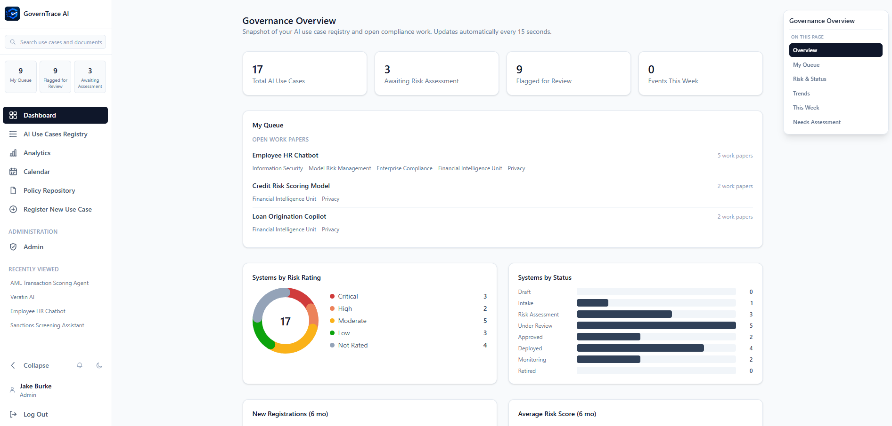
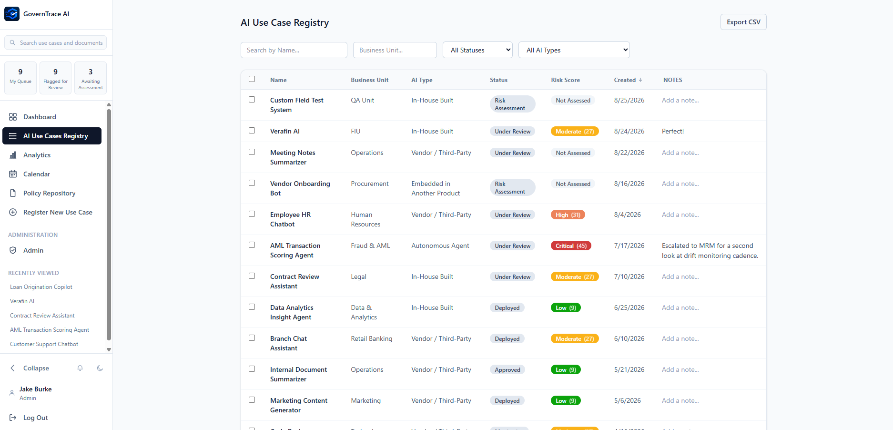
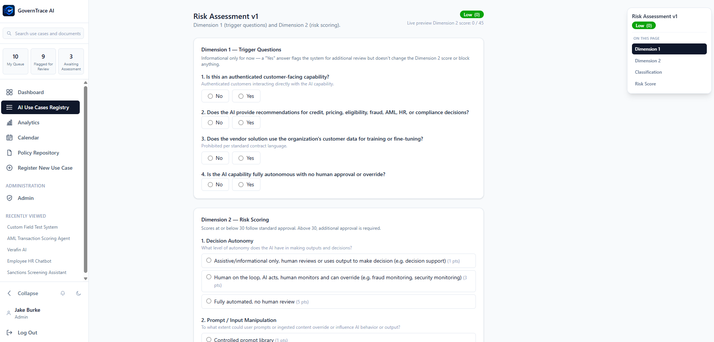
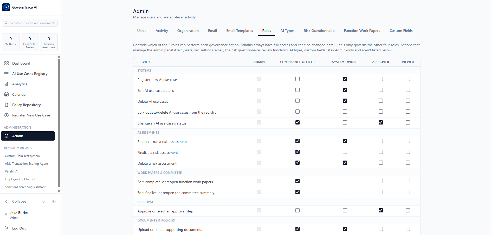

<p align="center">
  
</p>

**An internal, multi-user platform for running an organization's AI governance program end-to-end** — from intake and risk scoring through cross-functional review, committee sign-off, and formal approval — with role-based access, a full audit trail, and email notifications throughout.


> **Status:** actively developed proof of concept. Functionally complete for a single-organization deployment; not yet hardened for production (see [Known limitations](#known-limitations)).

## Contents

- [Overview](#overview)
- [Screenshots](#screenshots)
- [Features](#features)
- [Tech stack](#tech-stack)
- [Getting started](#getting-started)
- [The governance workflow](#the-governance-workflow)
- [Admin panel](#admin-panel)
- [Project structure](#project-structure)
- [Known limitations](#known-limitations)

## Overview

GovernTrace AI models a realistic enterprise AI governance process: someone registers an AI use case, it gets scored against a two-dimension risk questionnaire, that score routes it through the right functional review teams (privacy, security, model risk, etc.), a governance committee weighs in, and — depending on the risk tier — a sequential approval chain signs off before the system is considered approved. Every step is logged, every role's permissions are configurable, and the people who need to know get emailed.

It's built to be adapted: the risk questions, review functions, AI type taxonomy, custom intake fields, email copy, and role privileges are all admin-editable at runtime, not hardcoded — a new organization can reshape the whole process from the admin panel without touching code.

## Screenshots

<table>
<tr>
<td width="50%"><br><sub>Dashboard — a live snapshot of the registry and open compliance work</sub></td>
<td width="50%"><br><sub>Filterable, sortable AI Use Case Registry</sub></td>
</tr>
<tr>
<td width="50%"><br><sub>Two-dimension risk assessment with live scoring</sub></td>
<td width="50%"><br><sub>Admin-configurable role privilege matrix</sub></td>
</tr>
</table>

## Features

**Registry & intake**
- Guided multi-step intake wizard with autosave; a system exists as a `Draft` from the moment intake starts, so nothing is lost mid-flow
- Filterable/sortable use case registry with bulk owner-reassignment, bulk status change, bulk delete, and CSV/PDF export
- Org-editable custom intake fields and AI Type taxonomy (each type can carry an admin-written definition shown to the user while they pick)

**Risk assessment**
- Two-dimension scoring methodology: Dimension 1 trigger questions (informational review flags) and Dimension 2 weighted scoring (1/3/5 points across 9 questions) that determines approval authority
- Delivery Model / Capability Tier / Risk Factor classification, with tier and risk-factor suggestions auto-derived from the answers
- Full version history per system, with a formatted report view for any finalized assessment

**Cross-functional review**
- Risk classification auto-scopes which functional teams (Privacy, Security, Model Risk, Compliance, etc.) are in scope for a given system, each with its own structured work paper
- A committee summary view aggregates every in-scope work paper's rating and recommendation into a single final disposition
- A sequential, role-gated approval chain runs after committee sign-off — each step becomes actionable only once the one before it is approved

**Communication & tracking**
- Email notifications (SMTP or API/Resend, admin-configured) for every governance event, with per-notification-type templates an admin can customize and live-preview before saving
- In-app notifications, a dashboard with live trend charts, a calendar of meetings/re-assessment due dates/deployment dates, and threaded comments on each use case
- A full audit trail — per-system and system-wide — for every governance action

**Policy repository**
- Org-wide policy/standard/procedure documents, versioned, with full-text search across extracted content and inline preview for PDF/Word/Excel/PowerPoint files (no download required)

**Access control**
- Five built-in roles (Admin, Compliance Officer, System Owner, Approver, Viewer)
- An admin-configurable privilege matrix — toggle exactly which of the 15 governance actions each role can perform, live, no redeploy — while Admin itself always retains full access as a lockout safeguard

## Tech stack

| | |
|---|---|
| **Client** | React 19 + TypeScript, Vite, Tailwind CSS, React Router, TanStack Query |
| **Server** | Node + TypeScript, Express, Prisma ORM |
| **Database** | SQLite (file-based, zero setup). Schema is provider-agnostic — moving to Postgres later is a one-line change to `server/prisma/schema.prisma`'s `datasource` block plus a new `DATABASE_URL` |
| **Auth** | Cookie-based JWT sessions; every request re-checks the user's live role/active-status in the DB rather than trusting the token's claims |

## Getting started

Requires [Node.js](https://nodejs.org) 20+. One command handles everything else — installing dependencies, creating `server/.env` with a freshly generated secret, applying the database schema, and seeding demo accounts:

```bash
npm run setup
npm run dev   # runs the server (:4000) and client (:5173) together
```

(If you don't have dependencies installed yet, run `npm install` once first so `npm run setup` itself is available — or just run `node scripts/setup.js` directly, which works either way.)

Then open **http://localhost:5173**. All seeded accounts share the password `governance123`:

| Role | Email | Scope |
|---|---|---|
| Admin | `admin@example.com` | Full access to everything, including the admin panel |
| Compliance Officer | `compliance@example.com` | Run/finalize assessments, manage work papers & committee review, change status |
| System Owner | `owner@example.com` | Register and manage systems they own, run assessments |
| Approver | `approver@example.com` | Decide approval-chain steps, change status |
| Viewer | `viewer@example.com` | Read-only |

Every one of these defaults is itself editable from **Admin → Roles** once you're logged in.

`npm run setup` creates `server/.env` for you (with a random JWT secret) if it doesn't already exist — edit it afterward if you need to customize the port or client origin.

## The governance workflow

1. **Intake** — a use case is registered through the guided wizard (Basics → Data & Deployment → Supporting Documents → Review), saving progressively so an interrupted intake can always be resumed from the system's detail page.
2. **Risk assessment** — Dimension 1 (trigger questions, informational) and Dimension 2 (9 weighted questions, 1/3/5 points each) produce a score; scores at or below the org's configured threshold (default 30) route to standard approval, above it to additional approval. Delivery Model / Capability Tier / Risk Factors are classified alongside the score.
3. **Function work papers** — finalizing the assessment scopes in the relevant review teams based on that classification; each completes a structured work paper (section-by-section findings, risks, controls, a composite risk rating, and a recommendation).
4. **Committee review** — a summary view pulls every work paper's result together for a final disposition (approved, approved with conditions, not approved, deferred, or remanded).
5. **Approval chain** — an approved disposition kicks off a sequential sign-off chain, gated by role, with each step notifying whoever's turn it is next.
6. **Ongoing** — supporting documents, comments, and calendar events (re-assessment due dates, meetings, deployment dates) attach to the system for its whole lifecycle, and everything above writes to the audit trail.

## Admin panel

Everything about how the app behaves is editable at runtime from **Admin**, not hardcoded:

- **Users** — create accounts, change roles, deactivate/reactivate, reset passwords
- **Roles** — the privilege matrix described above
- **Organization** — branding, terminology, approval threshold, risk-band cutoffs, re-assessment cadence
- **Email** — SMTP/API delivery configuration, plus a **Email Templates** tab for per-notification-type subject/body/button-label with a live branded preview and test-send
- **AI Types** — the intake taxonomy, each with an optional definition shown to the user while picking
- **Risk Questionnaire** — the Dimension 1/2 questions and scoring options themselves
- **Function Work Papers** — the review teams, their in-scope trigger conditions, and each one's section/question structure
- **Custom Fields** — additional org-specific fields layered onto intake
- **Activity** — the system-wide audit log for everything not scoped to one use case

## Project structure

```
client/   React app — pages, components, and one api/ hook per resource (TanStack Query)
server/
  prisma/  schema.prisma + migrations + seed script
  src/
    routes/     one file per resource, mounted in index.ts
    services/   business logic + the lazy-seeded "org-editable list" pattern used throughout
    middleware/ requireAuth / requireRole / requirePermission
```

## Known limitations

This is a proof of concept, not a production deployment. Before running this for real, at minimum:

- Set a real, secret `JWT_SECRET` (the default in `.env.example` is explicitly a placeholder)
- Add SSO/enterprise auth if your organization requires it — this currently uses email/password only
- Review data-retention requirements — nothing currently ages out or archives automatically
- Note that email provider secrets (SMTP password / API key) are stored in the database in plain columns, not encrypted at rest — acceptable for local dev, not for a shared deployment
- Consider moving document storage off local disk (`server/uploads/`) to object storage if deploying beyond a single host
